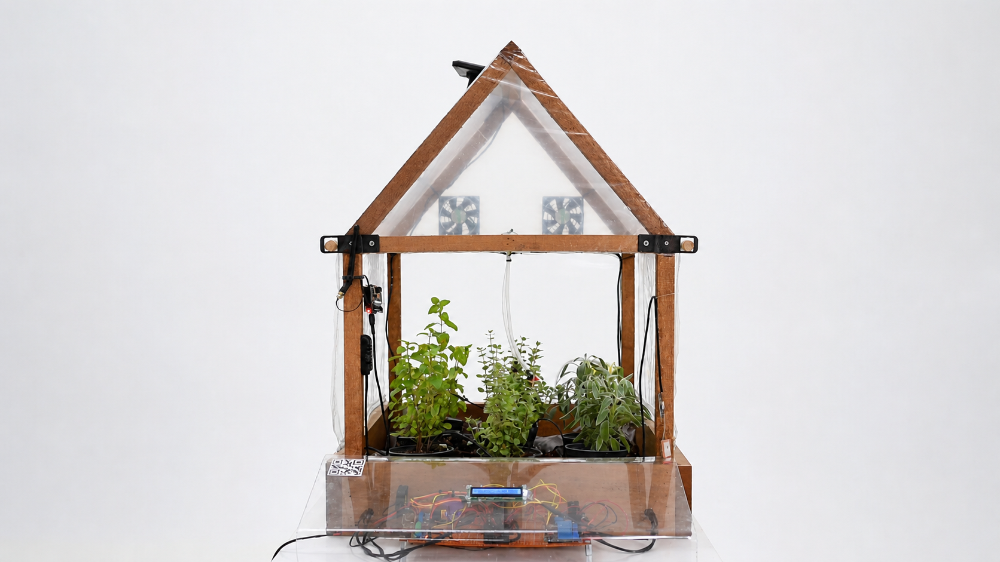
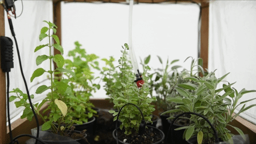
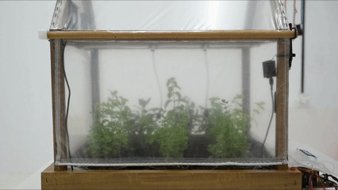
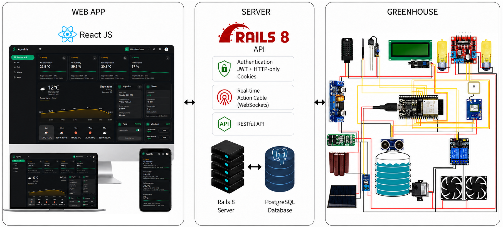

# Agrolify

> A fully-automated remote real-time monitoring and control of a smart greenhouse system.

Agrolify is a full-stack IoT platform that helps users monitor and control smart greenhouses from one dashboard. Users can track live environmental data, manage fans and pumps remotely, schedule watering, and receive alerts when conditions move outside target ranges. Built with a Rails 8 API server, React.js client, and ESP32 firmware, Agrolify closes the loop between software and the physical greenhouse.

### Live demo: [agrolify.com](https://agrolify.com)



<table>
  <tr>
    <td width="50%">
      
    </td>
    <td width="50%">
      
    </td>
  </tr>
</table>

## Contents

- [Why I built it](#why-i-built-it)
- [Engineering highlights](#engineering-highlights)
- [Tech stack](#tech-stack)
- [Architecture](#architecture)
- [Features](#features)
- [Project structure](#project-structure)
- [Run it locally](#run-it-locally)
- [Troubleshooting](#troubleshooting)
- [License](#license)

## Why I built it

I built Agrolify because I wanted to see how hardware and software come together in a real, end-to-end system. A sensor reading moves from a microcontroller through a Rails service to the browser as a live update — and a dashboard click travels back the same way. Owning the full stack made each boundary concrete and exposed engineering tradeoffs that a typical CRUD app often hides.

## Engineering highlights

- **Real-time data pipeline.** Telemetry flows from the greenhouse to the browser over Action Cable WebSocket channels, with one channel per device for control traffic and per-user channels for measurements and notifications. The dashboard updates live without polling.
- **Cookie-based JWT auth.** Sessions are issued as JWTs and stored in `HttpOnly`, `SameSite` cookies, so the React client never touches the token and the API stays stateless.
- **Automation rules engine.** The Rails service evaluates each incoming measurement against per-device thresholds, drives fan automation, and emits notifications — all on the server, so behavior is consistent regardless of which client is connected.
- **Hardware integration.** ESP32 firmware reads sensors, drives actuators, and holds a persistent Action Cable connection to Rails authenticated by a per-device token — the same protocol the browser uses, so the device is just another subscriber.

## Tech stack

| Layer | Stack |
| --- | --- |
| Server | Ruby on Rails 8, PostgreSQL, Action Cable, Puma, JWT, RSpec |
| Client | React.js 19, Redux Toolkit, React Router, Ant Design, Recharts, i18next, Axios, Vite |
| Device | ESP32, C++ (Arduino), WebSocketsClient, ArduinoJson, WiFiManager |

## Architecture



### Server

A Rails 8 API serves REST endpoints for auth, profile, devices, schedules, and logs, while Action Cable handles the real-time surface: a `DeviceChannel` per device for control traffic, a `MeasurementsChannel` per user for telemetry fan-out, and a `NotificationsChannel` for alerts. PostgreSQL stores users, devices, measurements, schedules, logs, and notifications. JWTs are issued at login and kept in an `HttpOnly` cookie.

### Client

A React.js single-page app backed by a Redux Toolkit store fed from both the REST client and the WebSocket. Ant Design and Recharts render the UI; i18next handles localization. The same Action Cable subscriptions used by the device deliver live updates to the dashboard.

### Device

An ESP32 reads from a DHT21 air sensor, DS18B20 soil probe, capacitive moisture probe, HC-SR04 water-level sensor, and a GPS module, and drives a fan, a water pump, and window motors through a relay board. A persistent WebSocket connection to Rails, authenticated with the device token, carries measurements out and control commands in. A 16×2 LCD shows the latest readings locally.

## Features

- Live air and soil temperature, humidity, soil moisture, water tank level, and GPS location
- Historical charts for every measurement
- Remote fan and window control with command confirmation from the device
- Temperature-based fan automation and threshold alerts
- Recurring watering schedules and watering history

## Project structure

<details>
<summary><strong>Project tree</strong></summary>

```text
agrolify/
├── client/                       React client (Vite)
│   └── src/
│       ├── app/                  router, store wiring, top-level providers
│       ├── features/             one folder per product area
│       │   ├── auth/             login, register, session
│       │   ├── dashboard/        live overview and control cards
│       │   ├── devices/          device list, attach/detach, selected device
│       │   ├── air/              air charts, fan control
│       │   ├── soil/             soil charts
│       │   ├── water/            tank, pump, watering schedules and logs
│       │   ├── maps/             device location on Google Maps
│       │   ├── measurements/     shared measurement state and selectors
│       │   ├── notifications/    inbox and real-time alerts
│       │   ├── profile/          account settings, avatar
│       │   ├── home/             public landing page
│       │   └── error404/         404 page
│       └── shared/               api client, layout shell, i18n, theme, utils
│
├── server/                       Rails 8 API
│   └── app/
│       ├── controllers/
│       │   ├── auth/             registrations, sessions
│       │   └── devices/          measurements, fans, windows, watering
│       │                         schedules and logs, notifications, weather,
│       │                         selected device — all nested under the
│       │                         user's currently selected device
│       ├── channels/             DeviceChannel, MeasurementsChannel,
│       │                         NotificationsChannel
│       ├── models/               User, Device, Measurement, Fan, Window,
│       │                         WateringLog, WateringSchedule, Notification
│       ├── serializers/          JSON shapes returned to the client
│       ├── services/             automation rules, schedule evaluation
│       └── jobs/                 background work
│
└── esp/device/                   ESP firmware (Arduino sketch)
    ├── device.ino                setup + loop
    ├── Air, Soil, Water,         sensor wrappers
    │   Gps, Lcd
    ├── Relay, Windows            actuator wrappers
    ├── sensors.h                 pin map and shared types
    ├── device_secrets.local.example.h   template for local development
    ├── device_secrets.render.example.h  template for production deployment
    └── device_secrets.h          your WiFi, WebSocket host, device token (gitignored)
```

</details>

## Run it locally

### Prerequisites

| Tool | Version / note |
| --- | --- |
| Ruby | 3.4.3, see `server/.ruby-version` |
| Node.js | 20 or newer |
| PostgreSQL | 14 or newer, running locally |
| Arduino IDE | Required only for flashing the ESP32 firmware |

### Server

**1. Create the environment file**

```bash
cd server
cp .env.example .env
```

**2. Set the required values in `server/.env`**

| Variable | Purpose |
| --- | --- |
| `DB_USERNAME` / `DB_PASSWORD` | Local PostgreSQL credentials |
| `SECRET_KEY_BASE` / `JWT_SECRET` | Long random strings, generated with `bin/rails secret` |
| `FRONTEND_URL` | Client origin, usually `http://localhost:5173` |
| `OPENWEATHER_API_KEY` | Optional; the weather card stays empty without it |

**3. Install dependencies, prepare data, and start Rails**

```bash
bundle install
bin/rails db:prepare    # create + migrate dev and test databases
bin/rails db:seed       # demo account + a fully populated device
bin/rails server        # http://localhost:3000
```

> **Note:** `db:seed` creates a demo device with realistic measurements, watering schedules, and notifications, so the dashboard, charts, and map render fully **without any hardware connected**.

### Client

**1. Create the environment file (new terminal)**

```bash
cd client
cp .env.example .env
```

**2. Set the client values in `client/.env`**

| Variable | Purpose |
| --- | --- |
| `VITE_API_BASE_URL` | Rails API origin, usually `http://localhost:3000` |
| `VITE_GOOGLE_MAPS_API_KEY` | Optional; needed only for the map page |

**3. Install dependencies and start Vite**

```bash
npm install
npm run dev             # http://localhost:5173 by default
```

**4. Sign in with the seeded demo account**

```text
Email:    demo@example.com
Password: demo1234
```

### ESP32 firmware

**1. Create the secrets file**

```bash
cd esp/device
cp device_secrets.local.example.h device_secrets.h
```

**2. Set the required values in `device_secrets.h`**

| Constant | Purpose |
| --- | --- |
| `DEVICE_WIFI_SSID` / `DEVICE_WIFI_PASSWORD` | WiFi network used by the ESP32 |
| `DEVICE_WEBSOCKET_HOST` / `DEVICE_WEBSOCKET_ORIGIN` | LAN IP of the machine running Rails, not `localhost` |
| `DEVICE_TOKEN` | Device token |

**3. Restart Rails so the ESP on your LAN can reach it**

```bash
bin/rails server -b 0.0.0.0
```

**4. Flash the firmware**

1. Open `device.ino` in the Arduino IDE.
2. Install the **ArduinoJson**, **WebSocketsClient**, **WiFiManager**, **DHT**, **OneWire**, **DallasTemperature**, **TinyGPS++**, and **LiquidCrystal_I2C** libraries.
3. Select your ESP board and upload.

The Rails log will show the device subscribing to `/cable` and posting measurements within a few seconds, and the dashboard at `http://localhost:5173` will start streaming live readings.

## Troubleshooting

- **ESP can't connect to Rails** — `bin/rails server` binds to `127.0.0.1` by default, which is unreachable from the ESP. Bind to all interfaces instead: `bin/rails server -b 0.0.0.0`.
- **Weather card or map are blank** — those rely on `OPENWEATHER_API_KEY` (server) and `VITE_GOOGLE_MAPS_API_KEY` (client). The rest of the app works without them.

## License

This project is licensed under the MIT License. See the [LICENSE](LICENSE) file for details.
